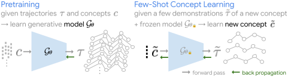

# Few-Shot Task Learning through Inverse Generative Modeling
Code for few-shot learning tasks as proposed in [Few-Shot Task Learning through Inverse Generative Modeling](https://avivne.github.io/ftl-igm)




## Setup
Clone the repository
  ```
  git clone https://github.com/avivne/ftl-igm.git
  ```
Create and activate a virtual environment
  ```
  conda create -n ftl-igm python=3.8.16
  conda activate ftl-igm
  ```
Install requirements
  ```
  pip install -r requirements.txt
  ```
Download the [data](https://www.dropbox.com/scl/fo/tbzextj52jez9298ywzk5/AMqMApxiAFAzC5Nyt16jQL8?rlkey=exknjldf7t4vw8vx4pv8vgvah&st=0cpbg113&dl=0) and unzip under `data`.


## Training and Evaluation
The following scripts 
- Train a conditional diffusion model on a set of base tasks.
- Evaluate the model by generating the tasks.
- Learn a new task representation from few demonstrations by generating them with the frozen model. 
- Evaluate the learned new task representation by generating behavior conditioned on it.

### Environment setup
  ```
  cd path_to_dir/ftl-igm/code
  export PYTHONPATH="${PYTHONPATH}:path_to_dir/ftl-igm/code"
  ```

### Running the Scripts
Follow `scripts/bash.sh` for each domain:
1. Set the domain: `dataset_name` in `scripts/scripts_utils.py`.
2. Train the model: run `scripts/train.py`.
3. Update the model path: `diffusion_loadpath` in `config/<domain>.py`.
4. Evaluate the model: run `scripts/eval_train.py`.
5. Learn and evaluate a new task from few demonstrations: run `scripts/learn_concepts.py` with args as in `scripts/bash.sh`.


## Cite
If you use this code in your research, please consider citing
```
@inproceedings{netanyahu2024fewshot,
  title={Few-Shot Task Learning Through Inverse Generative Modeling},
  author={Netanyahu, Aviv and Du, Yilun and Bronars, Antonia and Pari, Jyothish and Tenenbaum, Joshua and Shu, Tianmin and Agrawal, Pulkit},
  booktitle={Advances in Neural Information Processing Systems},
  year={2024}
}
```


# Acknowledgements
The implementation is derived from [Descision Diffuser](https://arxiv.org/abs/2211.15657) and [Unsupervised Compositional Concepts Discovery](https://arxiv.org/abs/2306.05357).
The environments are derived from [AGENT](https://arxiv.org/abs/2102.12321), [MoCap](http://mocap.cs.cmu.edu/), [MoCap rendering](https://github.com/jutanke/mocap), and [HighwayEnv](https://github.com/Farama-Foundation/HighwayEnv).
